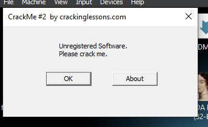
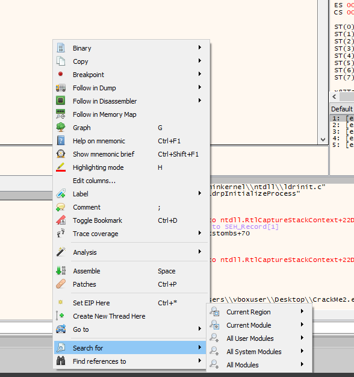
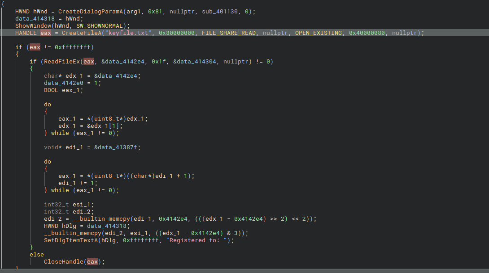
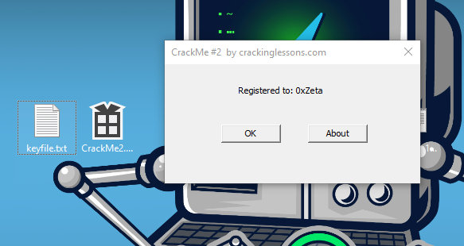

# [CrackMe Challenge - GUI Based](https://crackmes.one/crackme/5e49547033c5d4439bb2db75)

**Objective:** Without patching, register the software in your name.

---

### Steps to Solve:

1. **Initial Run:**  
   When you first run the challenge, a message box appears with the text: "Unregistered Software".  
   

2. **Open in x64dbg:**  
   Open the executable in **x64dbg**.  
   - Right-click and go to: `Search For -> All Modules -> String References`.  
   

3. **Finding Interesting Strings:**  
   In the list of strings, you'll find an interesting one: `keyfile.txt`.  
   Set a breakpoint on the address related to this string.  
   

4. **Analyzing in Disassembler (Binary Ninja):**  
   Take the address of the `keyfile.txt` reference and search for it in a disassembler like **Binary Ninja**.  
   You'll see code that checks for the existence of the file `keyfile.txt`. If the file exists, the content is read and added to the "Registered" message.

5. **Creating the Keyfile:**  
   Simply create a file named `keyfile.txt` and add some text in it. After this, the software will recognize the file and display a registered message.

   

