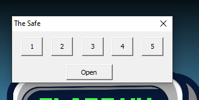
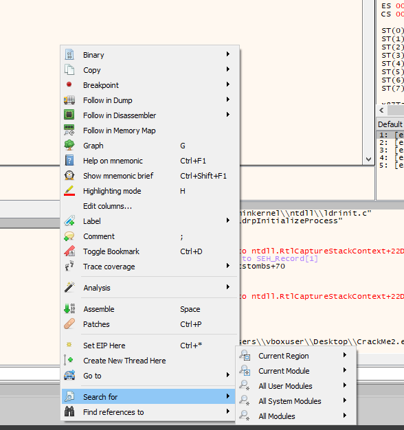
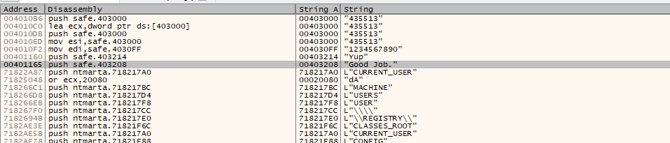
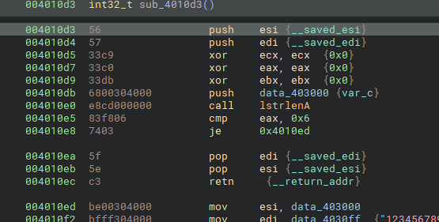
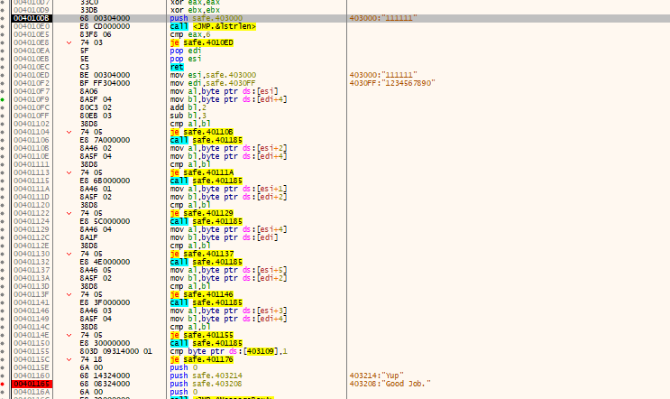
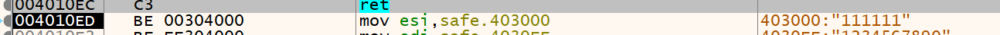
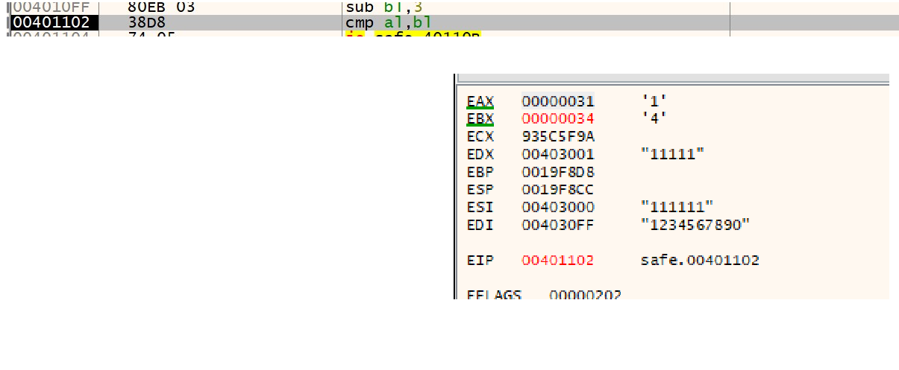

# [tropes_safe_cracker_1 by trope](https://crackmes.one/crackme/5ab77f6533c5d40ad448cb87)

### **Objective:**
1. No patching allowed — that would be too easy.
2. Find the correct combination to unlock the "safe".

---

## Steps to Solve:

### 1. **Initial Run:**  
When you first run the challenge, you’ll see buttons numbered from 1 to 5, and an "Open" button. However, when you click "Open", nothing happens and the program simply closes.  

### 2. **Open in x64dbg:**  
- Open the executable in **x64dbg**.
- Right-click and navigate to:  
  `Search For -> All Modules -> String References`.  

### 3. **Finding Interesting Strings:**  
In the list of strings, there’s an interesting one: `Good Job.`.  
This is likely the success message when you crack the safe. Set a breakpoint at the address related to this string.  

### 4. **Analyzing in Disassembler (Binary Ninja):**  
Take the address of the `Good Job.` string and search for the start of the function in a disassembler like **Binary Ninja**.  
This will help us analyze how the program verifies the correct combination.  

### 5. **Debugging in x64dbg:**  
- Set a breakpoint at the start of the function where the success message is triggered.
- Step through the code carefully to understand how the program verifies the combination.  

### 6. **Start Analyzing the Code:**  
- Click on the buttons in the program and press "Open" to observe how it handles inputs.
- After pressing the number **1** six times, you’ll see this comparison: `cmp eax, 0x6`.  
  This shows that the program expects the input length to be **6**. The program checks the length using the `call <JMP.&lstrlen>` function, and if the length is not 6, it simply closes.

### 7. **Check Input Verification:**
- Moving forward, you’ll see the input is loaded into memory at `mov esi, safe.403000`.  
  At this point, the program compares parts of the input to certain expected values.
  

- By stepping through the code, you’ll notice `cmp` instructions that compare portions of the input. The value of `ebx` will show the correct part of the password during these comparisons.  
  

### 8. **Iterating to Find the Combo:**  
Continue stepping through the comparisons until you figure out the correct combination. After testing, the correct combo is:  
**435513**

